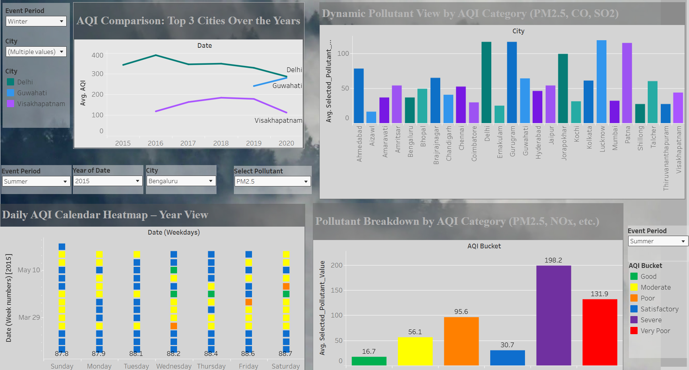
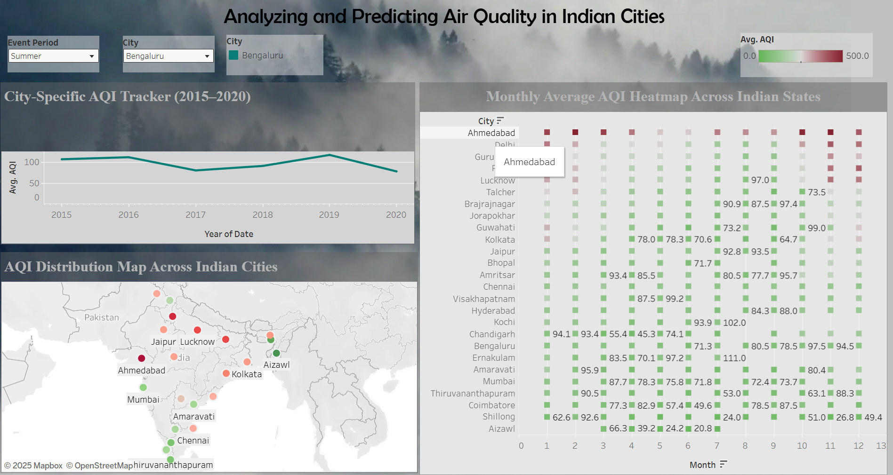

#  Air Quality Analysis in Indian Cities (2015–2020)

A data-driven deep dive into air pollution patterns across major Indian cities, using **Python (Jupyter Notebook)**, **SQL**, and **Tableau**. This project explores pollutant trends, seasonal impacts, and actionable insights on air quality.

---

##  Project Contents

| File | Description |
|------|-------------|
| `air_quality_analysis.ipynb` | Main Jupyter Notebook with data cleaning, EDA, visualizations |
| `air_quality_analysis.html` | Exported HTML version of the notebook |
| `mysql_cityclean.sql` | MySQL queries used for analysis |
| `tableau_pic1.png` | Screenshot of the final Tableau dashboard |
| `README.md` | You’re reading it! |

---

## Key Features

- Analysis of pollutants like PM2.5, NO₂, SO₂, CO, Benzene, etc.
- City-wise comparisons (Delhi, Mumbai, Chennai, Ahmedabad)
- Seasonal variations and festival/crop-burning impact
- Correlation heatmaps, line charts, and trend detection
- Policy and pollution source interpretation
- Tableau dashboard integration with a visual story

---

##  Tableau Dashboard

 View the full dashboard here:  
 [Click to open on Tableau Public](https://public.tableau.com/app/profile/priya.kumari1330/viz/AnalyzingandPredictingAirQualityinIndianCities2/Homepage)

>  Screenshot below:

---

##  Technologies Used

- Python (Pandas, Matplotlib, Seaborn)
- Jupyter Notebook (HTML export for report)
- MySQL (data queries and filtering)
- Tableau Public (dashboard and storytelling)
- GitHub (project sharing)

---

##  How to Run the Project

1. Clone this repo or download the ZIP  
2. Open the `.ipynb` file in Jupyter or VS Code  
3. View the HTML version if you don’t have Jupyter  
4. Explore the Tableau link for interactive dashboard  
5. Check `mysql_cityclean.sql` for SQL-based insights

---

##  Future Improvements

- Forecasting AQI using ML models (e.g. ARIMA)
- Real-time data integration (via API)
- Expanding to more cities and years (post-2020)

---

##  Author
 
 GitHub: https://github.com/lok-02498/BreathCheck-India.git

---

> _This project was created as part of a data science capstone, showcasing analytical thinking, data storytelling, and environmental awareness._
